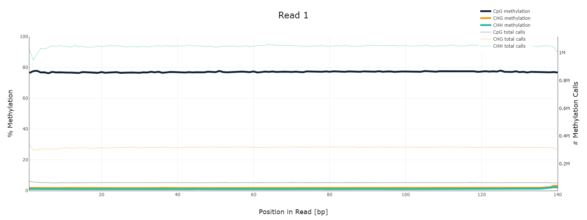
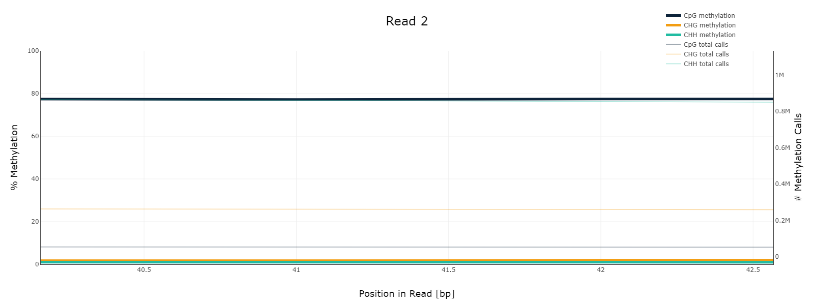
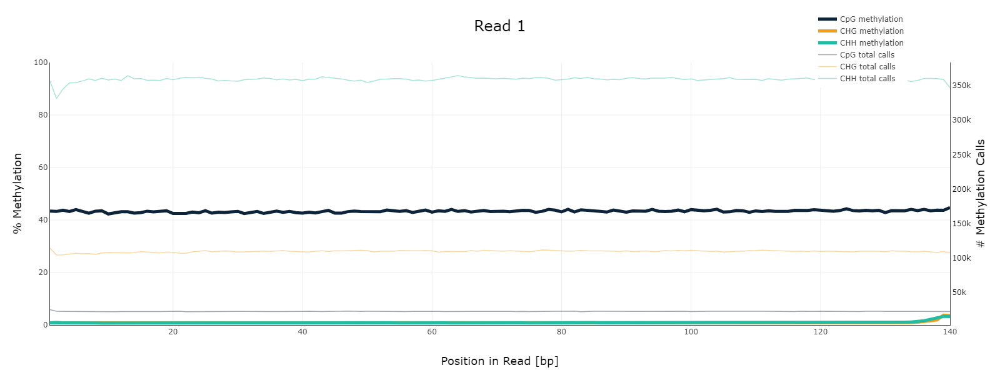
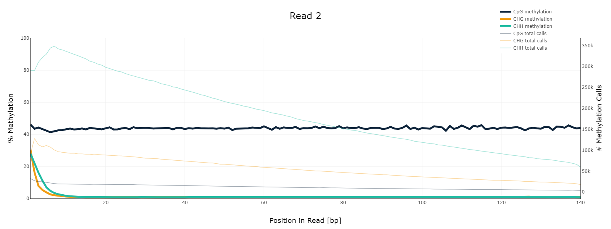
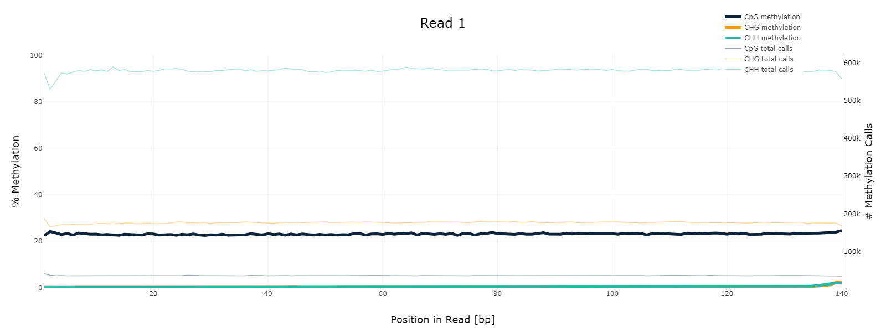
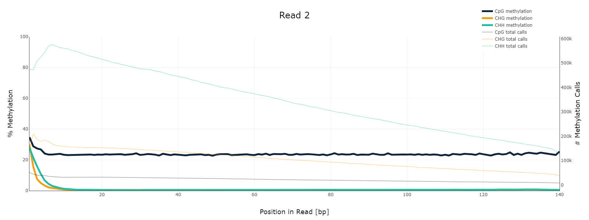

# hse_hw1_meth
## Часть 1

## Часть 2
### a + b

| Образцы  | 11347700-11367700   | 40185800-40195800   | deduplication % |
|----------|------|------|-----------------|
| cell8    | 1090 | 464  | 81.69           |
| epiblast | 2328 | 1062 | 97.08           |
| ICM      | 1456 | 630  | 90.92           |

**bash - skript:** ! ls *pe.bam | xargs -P 4 -tI{} deduplicate_bismark  --bam  --paired  -o s_{} {}
### c
Выполнено
### d
HTML отчеты в [папке](\html) 
#### Epiblast

  
   

M-bias (Read 1)             |  M-bias (Read 2) 
:-------------------------:|:-------------------------:
  |  

#### Cell8
M-bias (Read 1)             |  M-bias (Read 2) 
:-------------------------:|:-------------------------:
  |  

#### ICM
M-bias (Read 1)             |  M-bias (Read 2) 
:-------------------------:|:-------------------------:
  |  
