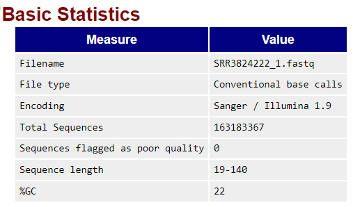
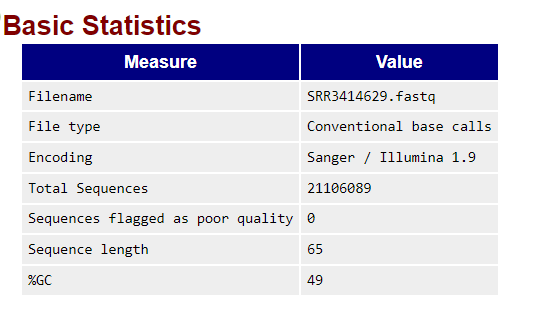
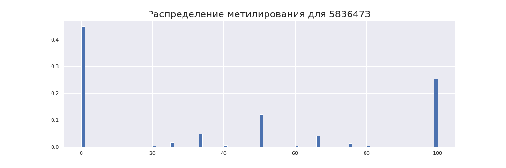
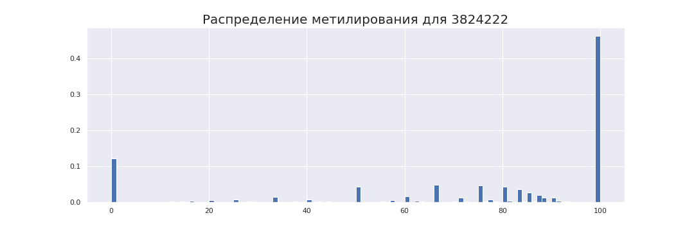
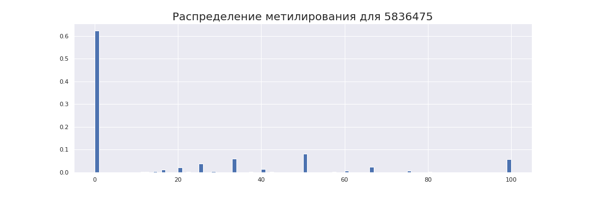
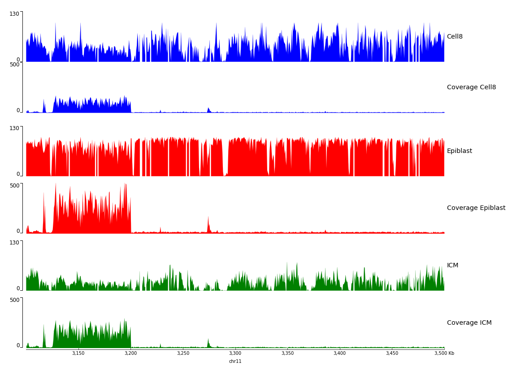
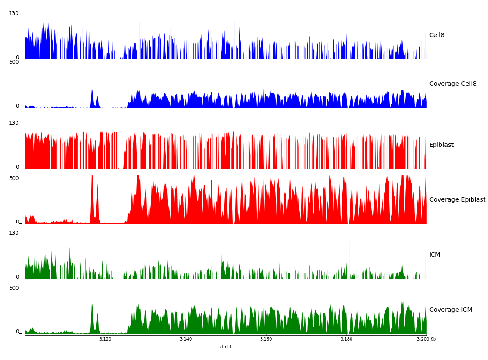

# hse_hw1_meth
[Ссылка на colab](https://colab.research.google.com/drive/1ERrP61iuTsqeYtFtXkzQMnvDECh247tc?usp=sharing)
## Часть 1
Проведем анализ QC прочтений для epiblast 
[HTML отчет](./html/SRR3824222_1_fastqc.html)

### Какие особенности можно наблюдать по сравнению с секвенированием ДНК или РНК?

BS - SEQ            |  RNA
:-------------------------:|:-------------------------:
  |  

Для РНК процент GC (49%)  более чем в два раза выше, чем у BS-Seq (22 %)

BS - SEQ            |  RNA
:-------------------------:|:-------------------------:
  |  

В BS - SEQ почти отсутствуют Цитозины (C), cодержание Гуанина (G), ниже чем
в РНК, а Тимина (T) – выше

BS - SEQ            |  RNA
:-------------------------:|:-------------------------:
  |  

Здесь заметно сильное смещение  нормального распределения для per sequence GC content
## Часть 2
### Количество ридов, закартированных на конкретные участки для каждого образца и его дедубликация

| Образцы  | 11347700-11367700   | 40185800-40195800   | deduplication % |
|----------|------|------|-----------------|
| cell8    | 1090 | 464  | 81.69           |
| epiblast | 2328 | 1062 | 97.08           |
| ICM      | 1456 | 630  | 90.92           |

**bash - skript:** ```! ls *pe.bam | xargs -P 4 -tI{} deduplicate_bismark  --bam  --paired  -o s_{} {}```
### Коллинг метелирование
Выполнено
### Отчет и M-bias plot
HTML отчеты в [папке](\html) 

#### Cell8
<p float="left">
  
   
</p>

Процент CpG метилирования ~43%
#### Epiblast

<p float="left">
  
   
</p>

Здесь видно, что наблюдается самый большой процент (~80%) CpG метилирования ( по сравнению с cell 8 (~43%) и ICM(~23%))
#### ICM
<p float="left">
  
   
</p>

В данном случае наблюдается наименьший процент метилирования (~23%)

Для других значений зависимости примерно одинаковы для каждого типа тканей:
+ CHH и CHG метилирования примерно у нуля для обоих ридов
+ В зависимости от позиции в 2 риде процент метиляции для общего числа вызов СHH падает
### Гистограмы распределения метелирования цитозинов по хромосоме
Код:
```
names = ['3824222', '5836473', '5836475']
for kod in names:
  name = 's_SRR' + kod + '_1_bismark_bt2_pe.deduplicated.bedGraph'
  a = pd.read_csv(name, delimiter='\t', skiprows=1, header=None)
  fig = plt.figure(figsize=(15, 5))
  plt.title('Распределение метилирования для %s' % kod, fontsize=20) 
  plt.hist(a[3], bins=100, density=True)
  plt.xlabel('Процент метилированных цитозинов')
  plt.ylabel('Частота')
  plt.show()
  fig.savefig('%s.png' % kod)
```
#### Cell8


#### Epiblast


#### ICM


Здесь мы видим что сила метилирования цитозина наибольшая у epiblast, в этом случае метилируется большая часть хромосомы. Так же наблюдается нормальное распркделение в центра для cell8 с большим пиком в 0 (% мет цитозинов). В случае последнего у него наибольшая частота наблюдается для низкопроценто метилированного цитозина.

В результате мы видим, что на разных этапах развития эмбриона, уровень метилирования действительно меняется.
### Визуализация уровня метелирования и покрытия
Рассмотрим сначала большой участок


Более короткий:

